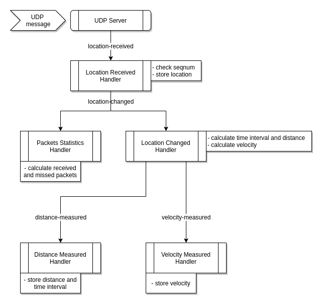
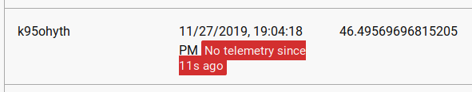
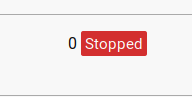

# Drones tracking server

This application is a server which tracks location telemetry messages from
flying drones. This is a playground project for experiments with Node.js and 
other tech. A simplistic drone model is used, which sends only its coordinates 
over periodic time intervals via cellular network. The tracking requirements 
are simple: collect only latest location and calculate speed and distance 
travelled over last N seconds.

# Usage

## Build and run from sources

### Prerequisites

- Node.js (version 10.x)
- npm (version 6.x)
- latest protobuf compiler if you want to re-build protobuf client (not
  necessary): https://github.com/protocolbuffers/protobuf/releases

### Build

```
npm run build
```

### Test

```
npm run test
```

### Compile protobuf

```
npm run protoc
``` 
(need to have `protoc` available in the path)

### Start server

```
node build/server.js <udp_port> <http_port>
```

or

```
npm run start-server
``` 
(starts on UDP 50050 and HTTP 8080)

### Start client

```
node build/client.js <server_host> <server_udp_port> <count_of_drones> [<time_interval_between_sends>]
```

or

```
npm run start-client
``` 
(sends to localhost:50050 10 drones every 1 second)

## Run from Docker

### Prerequisutes

- Docker for desktop (version 18.x)

### Pull images

The latest version code image is available on public Docker Hub, so one can pull
the images directly:

```
docker pull timbabyuk/drone-tracking-server
docker pull timbabyuk/drone-tracking-client
```

### Build images

Instead, one can build images from sources

### Start server

```
docker run -p 8080:8080/tcp -p 50050:50050/udp timbabyuk/drone-tracking-server
```
here 8080 is HTTP port, 50050 is UDP port. Change if these ports already 
taken on your dev machine. For example: `-p 80:8080/tcp -p 60060:50050/upd`

### Start client

```
docker run -e TARGETHOST=192.168.2.101 -e TARGETPORT=50050 -e DRONESCOUNT=50 timbabyuk/drone-tracking-client
```
Change -e environment variables to set the actual server location and drones
count. If server and client containers run on the same machine, don't use
`localhost` or `127.0.0.1` because client will send packets to its own
container. Instead, use the host machine's main network interface address, and
docker's bridge connection will do the trick.

## Public preview

The service is deployed on Google Kubernetes cluster and available via:

- HTTP endpoint: http://104.154.130.247:80
- UDP endpoint:  130.211.123.186:50050

The Kluster is a single node `n1-standard-1` machine (the smallest one), with
one managed pod exposed by two load balancers (for tcp and udp). Location:
`us-central1-a`. The service holds 1000 drones reporting every 1 second from 
wired connection in Ukraine with 0 packets lost. The service holds 10000 drones 
reporting every 1 second from the same connection with ~50% packets lost 
(due to network limitations).


# Description

Drones are reporting via cellular network (2G-4G). That's why it is very 
important to limit the amount of data transmitted: it’s expensive. 
There are two other reasons why need to limit cellular traffic:
- cellular network is slow (worse realtime)
- cellular transmitter consumes a lot of drone's battery power

Realtime means that the server needs to get drone location update ASAP.

In this app we don't need to keep location history, and only the latest drone 
location matters. From this, no 100% message delivery guarantee
required: even if some packets lost, new ones come. Transport for this
application should be “reliable enough”.

## Protocol selection

Cellulars provide IP network. Popular choice to send data over IP is TCP/IP. But
based on limitations above, TCP/IP has some drawbacks:

- TCP/IP packets contain relatively large header (20-60 bytes) compared to small
  payload
- TCP/IP is session based. Session establishment/closing requires additional
  packets exchange before/after actual data exchange.
- TCP/IP is a protocol of guaranteed delivery. This means that there are
  acknowledgement messages sent
- TCP/IP is a protocol of guaranteed order. This means that until at least one
  packet not delivered, new ones could be re-sent again

So it’s obvious that TCP/IP is not the best choice:

- traffic overhead because of packet header size and amount of protocol’s system
  messages
- slow delivery because of handshaking, guaranteed delivery and delivery order
  extraness

Some of these flaws could be fixed though: for example, instead of frequent
session establishments, it’s better to keep TCP session open for a long period
of time. This eliminates unnecessary handshaking traffic. But unstable nature of
cellular network may cause client reconnection and as the result - TCP session
loss. Also, keeping session open is additional resource pressure on server side.

Another option to send data is UDP protocol. Compared to TCP, it has many
differences:

- small UPD header (8 bytes)
- no sessions
- no delivery guarantee overhead
- no ordering delivery guarantee overhead

All these characteristics cause significant traffic reduce and speed increase
with some data loss/duplication possibility. When networking works stable,
reliability should be fine. Many real-time applications use UDP: Voip, video
streaming, online games, devices telemetry etc.

Concluding this comparison between TCP and UDP, for this application UDP was
selected.

## Technology stack

Node.js was selected for server implementation. 

Typescript was used instead of plain JS. The main reason TS was chosen is to add
types safety: less errors related to incompatible types usage, easier to
refactor. Also, because TS is very popular in Node.js community, there are
typing files (d.ts) for almost all popular npm packages. As a result it’s easier
to learn new APIs, which helps a lot.

## Drone Communication

The simplest minimalistic drone model sends to the server its `drone ID`, also 
its current location: 

`latitude, longitude, altitude`

Because UDP doesn’t provide order guarantee, and we’re interested only in the
latest updates, so we need to control order of drone’s messages on the level of
application. The easiest choice was to use additional field with sequential
number of a message which is controlled by a drone:

`seqnum`

As a result the drone's message should contain these fields:

```
droneId
seqnum
latitude
longitude
altitude
```

## Formatting

When formatting was choosing, one of the main requirements is formatted message
size. Structured formats like JSON and XML are very popular and easy to use, not
to mention human readable, but they are heavyweight because schema information
is included into the payload. Instead, preference was given to schema-less
format.

The easiest choice was simple comma-separated string. The drone message in this
format could look like this:

`drone_id,50,46.491221,30.746575,150`

This string of 35 characters could be transferred in just 35 bytes of UDP
payload.

The only downside of this format is the absence of schema and necessity to write
own parser/formatter for each consumer/producer (though its implementation is
simple).

In the result, instead of comma separated string, protobuf was chosen. The
reasons to use protobuf:

- minimal size because no schema information is in the message
- schema is stored in `.proto` file which could be shared across other
  applications
- multiplatform support: while server works on NodeJS, clients will run on drone
  devices which could use another platforms (c++, java, etc)

Note that from message size point of view, there are few reasons to prefer
protobuf with this type of payload instead of comma separated string. With the
previous example message which was encoded into 35 bytes, protobuf encodes the
same data into 39 bytes. Despite this small overhead, reusable schema file and
crossplatform auto generated clients support were the reason why protobuf was
selected.

In order to compile `.proto` file one needs to have protobuf client compiler
`protoc`. The compiler doesn’t exist on npm, so has to be obtained from protobuf
release page: https://github.com/protocolbuffers/protobuf/releases Compilers are
in `protoc-....zip` archives. In order to compile proto file, run `npm run
protoc` (make sure protoc binary is in your path).

## Architecture

Drones are only sending their locations in predefined time intervals. But we 
also need to know:

- velocity
- distance passed in the last N (let's say 10) seconds

So each time we receive new location we need to:

- calculate distance between old and new location
- calculate time interval between old and new location received time
- based on distance and time calculate velocity

Architecture of the application is based on events. This approach allows to
decouple components from each other. This in turn makes easier such things as:
components composition, rearranging, adding new features (such as logging,
tracing, other non-functional requirements), testing. 

Components of the server communicate between each other using event bus which is
located in `event-bus.ts` file:

```
export interface IBus {
    subscribe(event: string, handler: IHandler): { unsubscribe(): void };
    publish(event: string, ...args: any[]): void;
}
```

`subscribe` method creates subscription to a specific event type specified by
event name, `handler: IHandler` is an object which contains callback function
`onEvent`. `subscribe` returns an object which allows to unsubscribe from 
the events by calling `unsubscribe()`.

`publish` fires an event specified by `event` parameter and accepts any event
data parameters.

`IBus` implementation is a simple in-memory map.

Server has the following events which are specified in `events.ts` file:

```
drone-location-received - new location message came by drone
drone-location-changed  - the message checked and accepted, drone location has changed
drone-distance-measured - drone’s distance and time interval since last message calculated
drone-velocity-measured - drone’s velocity calculated
drone-flush-check       - occurs periodically when need to remove offline drones
drone-flush             - offline drone found and needs to be removed
```

All event handlers which process these events are located in `event-handlers`
directory.

The events flow is this:



Subscription to all events is done in `server.ts` file, which is an entry point
of the server application and composition root of all dependencies.

## Data models

In order to display drones states server needs to store the states somewhere.
Drone state could be divided into these categories:

- factual state reported by drone:
  - drone ID
  - latitude
  - longitude
  - altitude
  - seqnum
  - time received (it’s captured by server, but could treat as factual)
- calculated state:
  - distance since previous location
  - time duration since last location
  - velocity

To measure quality of drone messages delivery (because UDP doesn’t guarantee
delivery), it’s useful to store statistics how many packets received vs lost.
This will be additional states of drone:

- received
- missed

"Missed" includes packets which didn't appear and which came late.

All these fields are included in types from `types.ts` file.

- `Location` - geo coordinates
- `DroneLocation` - composition of last drone's geo location, seqnum and time
  reported. Stored one per drone.
- `DroneDistance` - history record of distance drone travelled over period of
  time. Stored predefined count for each drone to be able to calculate last 10
  seconds travel path (20 records by default)
- `DronePackets` - statistics record of received/lost packets. Stored one per
  drone

## Storage

Data manipulation is hidden behind simple repository described in
`repository.ts`. In-memory repository implementation is a simple map.

The following repositories used in the app:

```
- IRepository<DroneLocation>
- IRepository<IList<DroneDistance>> - this is for pair distance+interval 
- IRepository<number>               - this if for drones velocities
- IRepository<DronePackets>
```

One of the requirements is to track drone’s distance it traveled during the
last 10 seconds. To achieve this, we need to store history of distances together
with the corresponding time intervals. To store history, interface `IList` was
introduced which simply adds item and returns readonly array of items.:

```
export interface IList<T> {
    add(item: T): void;
    items(): ReadonlyArray<T>;
}
```

To limit distance history, `LimitedDepthList` was implemented which removes an
item from the end when the limit reached.

Despite the server stores state in memory, it is easy to convert it to a
database storage by implementing appropriate repository. The only difference
would be to change synchronous interfaces to asynchronous which is
straightforward by applying async/await and converting return types to
`Promise<T>`. Example how asynchronous `getItem` method would look like in 
`IRepository`:

```
async getItem(id: string): Promise<T | undefined> {
    return await this.db.get(id);
}
```

Where `db.get(id)` is asyncronous method to call the database.

For simplicity reasons the server was implemented completely in synchronous 
manner because all of its storage is in a single instance, in memory.

## Servers

UDP server is implemented in `udpServer.ts` file. On new datagram arrived, the
payload is deserialized using protobuf generated client and
`drone-location-received` event is published.

UDP port is controlled by the first argument to the entry point.

HTTP server uses Express with Express Handlebars rendering engine - fast and
simple. `DroneView` type is used as view model which is built in
`DronesViewBuilder` class. Mini.css is used for simple layout.

HTTP port is controlled by the second argument to the entry point. When drone
stops sending telemetry data for more than 10 seconds, there is a red
notification appears in “Time reported” column:

 

When drone sends telemetry
but stops moving, red notification “Stopped” appears in “Moved” column:



## Storage cleanup

If drone doesn’t report for more than 30 seconds it is considered inactive and
removed from the storage. This is implemented by `startDronesFlushTimer`
function which is called by timer every 30 seconds and fires event
`drone-flush-check`. Then `DronesFlushCheckEventHandler` handles this event and
validates which drones don’t report for a period of time longer than a
predefined lifetime, and for each of those fires `drone-flush` event which
handled by `DroneFlushEventHandler` which removes a drone from storage.

## Math

Distance calculation is implemented in `distance_on_geoid` function from
`math.ts` file. It is based on Haversine formula.

## Time

Server needs current system time for correct functioning. Instead of native
`Date.now()` API, current time obtaining was hidden behind `Now` function
interface with two implementations: 

- `RealNow` which takes current system time
- `MakeFakeNow` function which creates a fixed time function.

This brings additional decoupling and improves unit testing experience.

## Client

Testing emulator is implemented in `client.ts` file. This is `DroneEmulator`
class with some primitive Math.random()-based changes brought to drones
behavior. Target host, port, as well as drones count and message sent frequency
are passed via arguments.

## Docker

Both server and client could be run in container. Server's container definition
located in `server.Dockerfile`. Client's - `client.Dockerfile`.

## Tests

The solution contains a set of unit tests written in Mocha + Chai. The tests 
set is incomplete and was written for reference.